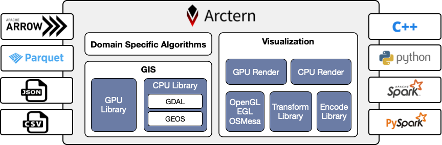
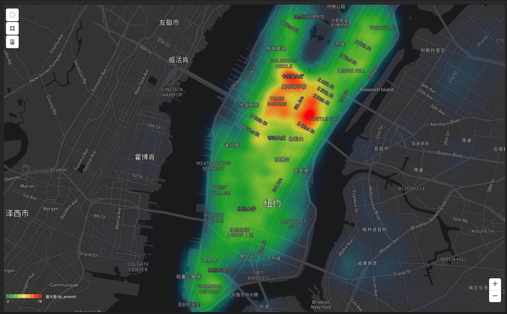

Arctern项目正在积极开发中，预计2020年4月开源0.1.0版本。非常感谢您的关注！

下面对Arctern项目的主要内容进行介绍。


#### 项目定位：

Arctern是一个面向大规模数据的地理信息分析引擎。定位如下：

1. 面向领域需求提供领域API，提高上层应用的开发效率。
2. 提供可扩展、低成本的分布式解决方案。
3. 针对地理信息分析算法提供GPU加速能力。
4. 构建GIS、SQL、ML混合分析能力。


#### 分析引擎：





上图是Arctern 0.1.0的基本架构。Arctern分析引擎主要包含两部分内容，分别是地理信息数据处理（GIS）和地理信息数据可视化（Visualization）。当前版本包含OGC标准中常用的35个GIS API，涵盖几何对象的构造、访问、关系分析、度量。引擎中的可视化部分负责几何对象的渲染，API采用vega标准。与传统的web端渲染方案不同，Arctern采用服务器端渲染，可支撑大规模数据的轮廓图、热力图、散点图等渲染任务。在0.1.0版本中，地理信息数据处理与可视化均提供CPU/GPU两种实现，对外部提供统一的API，用户可根据需求灵活选择是否采用GPU加速。

数据接口方面，Arctern支持标准数值类型及WKB格式，支持json，csv，parquet格式的文件导入。内存层基于Arrow按列式组织数据，可提供与外部系统的零拷贝数据交换。

调用接口方面，Arctern开放C++、Python及Spark三层API，均为列式处理接口。C++接口基于Arrow标准进行传参及返回，Python及Spark接口的参数对象为dataframe。由于Spark自3.0版本开始支持GPU资源管理，当前Arctern的Spark接口仅支持面向Spark3.0的适配。


#### 代码示例：

```python
# Invoke Arctern API in PySpark

from pyspark.sql import SparkSession
from arctern_pyspark import register_funcs, heatmap
from arctern.util import save_png
from arctern.util.vega import vega_heatmap 

if __name__== "__main__":
    spark = SparkSession \
            .builder \
            .appName("Arctern-PySpark example") \
            .getOrCreate()

    spark.conf.set("spark.sql.execution.arrow.pyspark.enabled", "true")
    register_funcs(spark)

    df = spark.read.format("csv") \
         .option("header", True) \ 
         .option("delimiter", ",") \
         .schema("passenger_count long,  pickup_longitude double, pickup_latitude double") \
         .load("file:///tmp/0_5M_nyc_taxi_and_building.csv") \
         .cache()
    df.createOrReplaceTempView("nyc_taxi")
        
    res = spark.sql(
        "select ST_Point(pickup_longitude, pickup_latitude) as point, passenger_count as w \
        from nyc_taxi \
        where ST_Within(ST_Point(pickup_longitude, pickup_latitude), 'POLYGON ((-73.998427 40.730309, \
                                                                                -73.954348 40.730309, \
                                                                                -73.954348 40.780816, \
                                                                                -73.998427 40.780816, \
                                                                                -73.998427 40.730309))')")

    vega = vega_heatmap(1024, 896, 10.0, [-73.998427, 40.730309, -73.954348, 40.780816], 'EPSG:4326')
    res = heatmap(res, vega)
    save_png(res, '/tmp/heatmap.png')

    spark.catalog.dropTempView("nyc_taxi")

    spark.stop()
```


#### 可视化效果：

Arctern项目将与Sulidae项目同步开源。Sulidae项目是ZILLIZ团队研发的一款前端可视化系统，提供web前端渲染与服务器端渲染的混合可视化方案，兼顾web前端渲染的交互速度、灵活性以及后端的大规模数据渲染能力。

Arctern 0.1.0版本将提供与Sulidae的适配，以下是热力图与轮廓图的可视化效果，交互数据规模一千万条：




#### 近期工作：

##### v0.1.0

1. 支持OGC标准中常用的35个GIS API。
2. 支持面向大规模数据的轮廓图、热力图、散点图渲染。
3. 提供基于Arrow标准的C++、Python及Spark API。
4. 提供基于CPU实现的Arctern引擎。
5. 提供基于GPU加速的Arctern引擎。
6. 提供与前端可视化项目Sulidae的适配。
7. API手册，安装部署文档。

##### v0.2.0

1. 面向领域需求提供轨迹分析、地理信息统计分析的领域API。
2. 面向领域API提供时空索引。
3. 针对Spark3.0的性能调优。
4. 提供更多的GIS API。
5. 持续提升系统稳定性。


#### 当前进展：

##### 2020.03.10 达成

1. 支持OGC标准中常用的35个GIS API。
2. 支持面向大规模数据的轮廓图、热力图、散点图渲染。
3. 提供基于Arrow标准的C++、Python及Spark API。
4. 提供基于CPU实现的Arctern引擎。
5. 提供基于GPU加速的Arctern引擎。


#### 欢迎来交流：

##### github

https://github.com/zilliztech/arctern

##### email 

support@zilliz.com

##### ZILLIZ官方公众号


