# Arctern可视化组件简介

Arctern是一个面向大规模地理数据的开源分析引擎。Arctern的可视化组件提供直观，可交互的时空大数据可视化方案。可视化组件采用前后端混合渲染，兼顾前端渲染的良好交互性与后端的强劲运算能力。


# 1. 可视化类型


Arctern面向地理数据提供了地图、热力图、点图、轮廓图，同时提供了常规的折线图、直方图、气泡图、饼图、热力表、数据表格等。图表示例如下：

<div align="left"><div style="color:orange; display: inline-block; color: #999; padding: 2px; margin:0 auto;">热力图</div><br>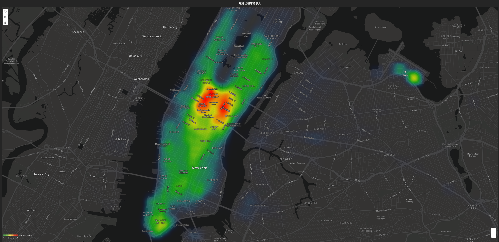</div>

<div align="left"><div style="color:orange; display: inline-block; color: #999; padding: 2px; margin:0 auto;">点图</div><br>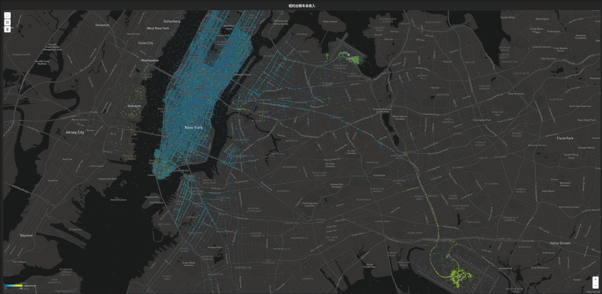</div>

<div align="left"><div style="color:orange; display: inline-block; color: #999; padding: 2px; margin:0 auto;">轮廓图</div><br>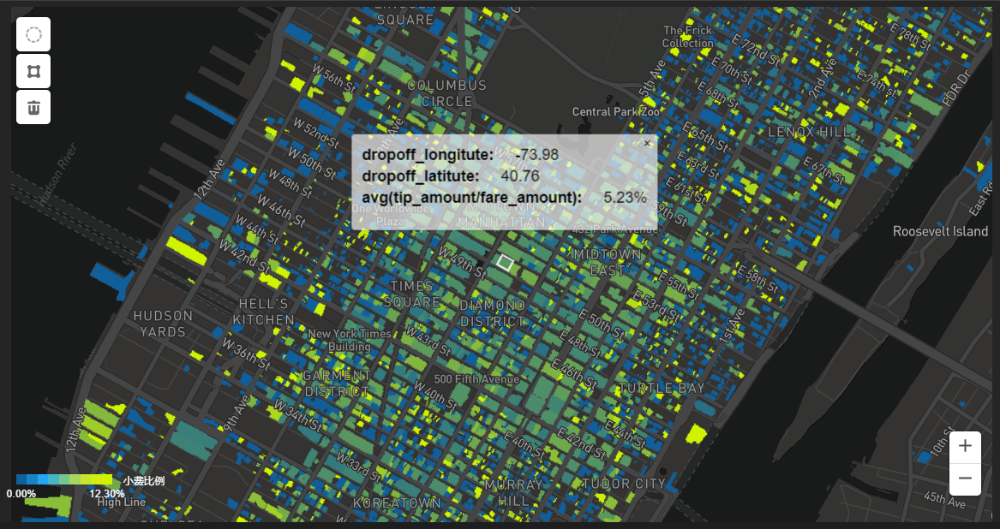</div>

<div align="left" style="color:orange; display: inline-block; color: #999; padding: 2px; margin:0 auto;">常规图表</div>

<figure class="half">
  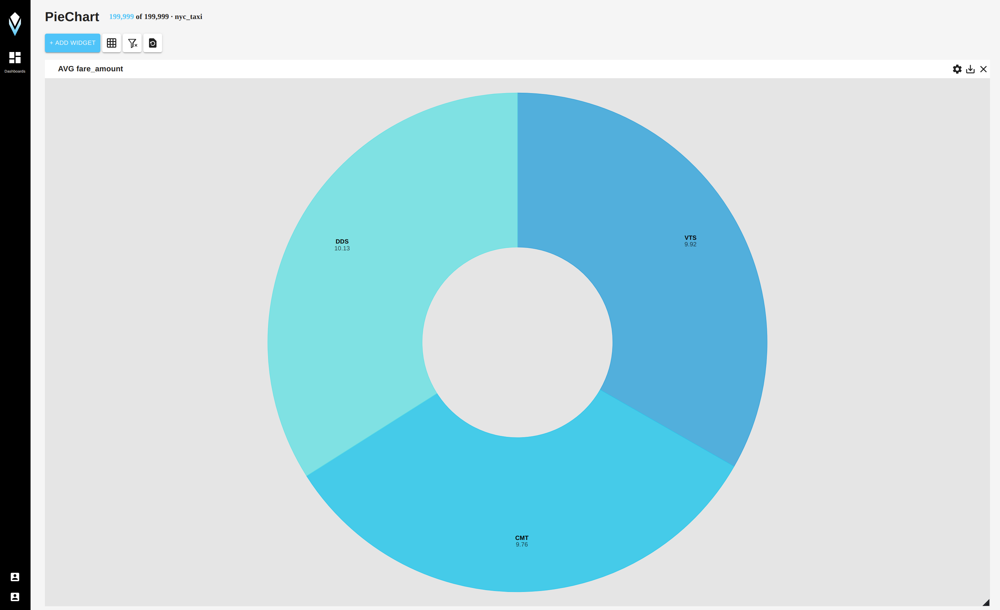
  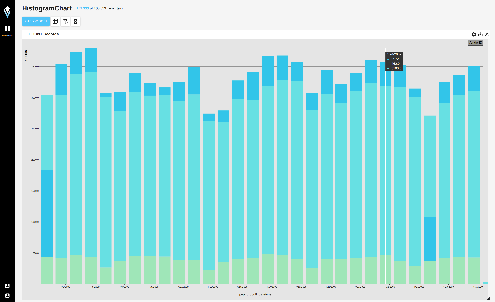
</figure>

<figure class="half">
  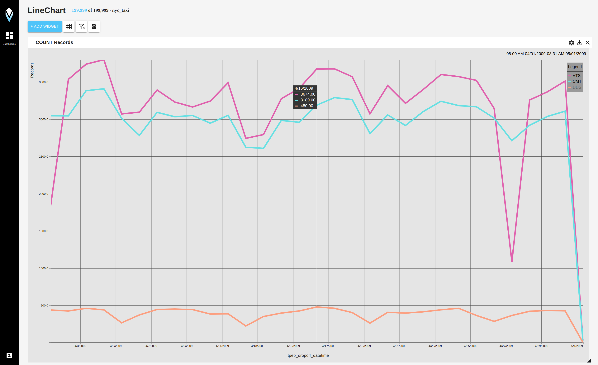
  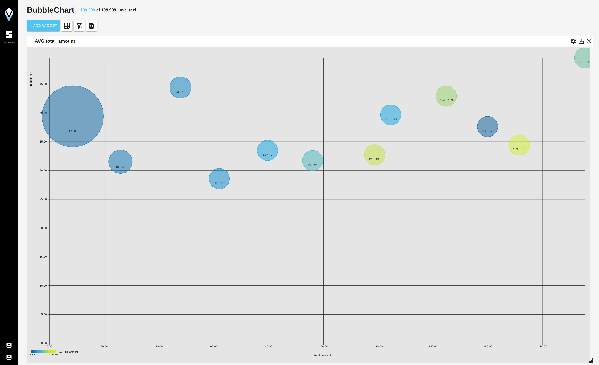
</figure>


# 2. 页面布局与图表交互


Arctern的可视化组件提供丰富的交互功能。用户可根据需要进行数据关联并创建不同种类图表。页面支持自定义布局:

<figure>
  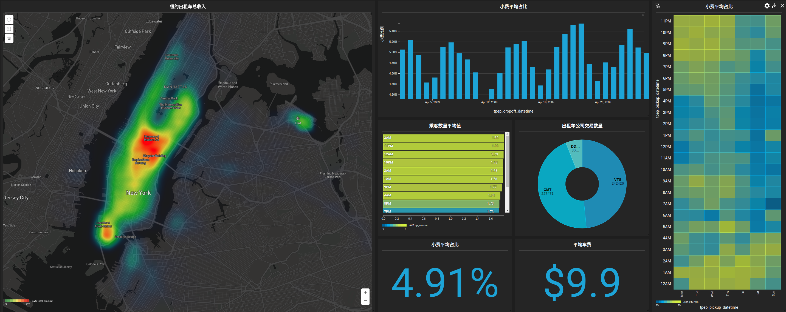
</figure>

同一页面内的图表支持交叉过滤(Cross Filter)。当用户为某个或某些图表添加过滤条件后，同一页面的其他图表也会做出交叉响应。以下图为例，当用户在右侧选定一个时间过滤窗口后，左侧点图也将按该时间窗口内的数据进行更新。

在当前版本中，Arctern的可视化组件支持如下过滤方式：时间选框，地图选框，饼图、直方图、热力表选片等。

<figure>
  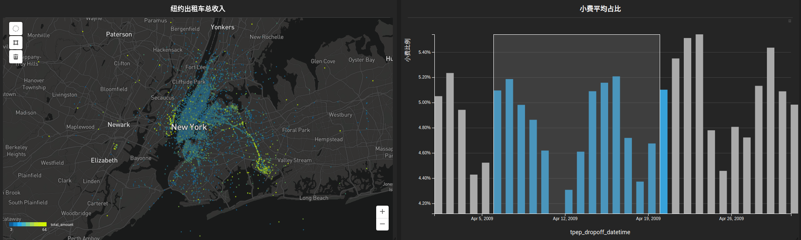
</figure>

几乎所有类型的图表都支持数据查询功能。当用户点选感兴趣的位置时，图表会返回该点的详细信息：

<figure>
  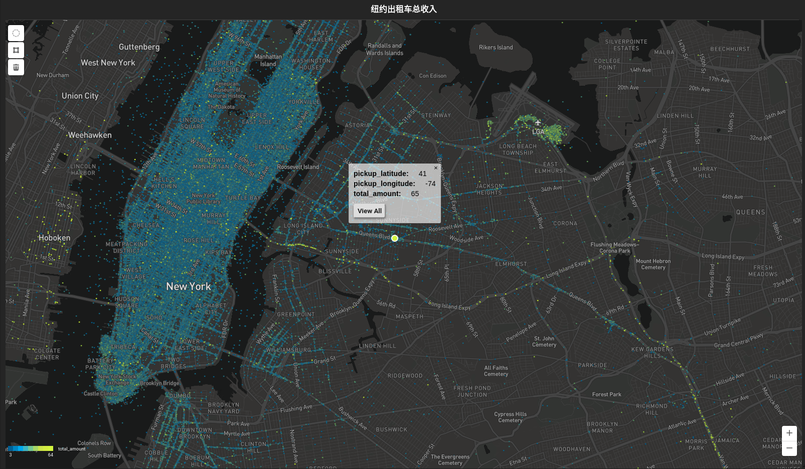
</figure>


# 3.技术方案
## 3.1 图形渲染流程


对于点图、热力图和轮廓图而言，前端展示的可视化内容由上层的服务器端的渲染结果和底层的地图数据叠加而成。Arctern服务器端根据用户的操作，通过依次执行数据查询、坐标投影、屏幕映射、像素上色、图片渲染等步骤最终得到渲染结果。对于底层地图，Arctern采用Mapbox展示当前窗口区域内的地图切片。

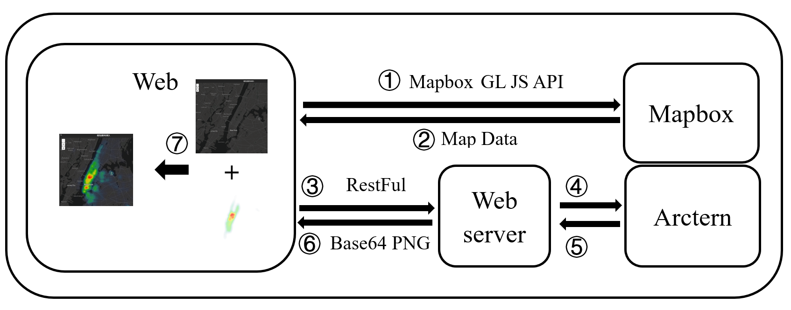

如上图所示，Web前端在接收到用户关于图形渲染的操作后，一方面根据用户的操作向Mapbox请求渲染区域的底层地图轮廓数据，用于展示可视化数据中的地理信息；另一方面，通过Restful接口向Web server发送操作请求，web server接收到请求后调用Arctern进行效果图的渲染。在接收到Arctern服务器端渲染结果之后，web server将结果返回给Web前端后。前端进一步将底层Mapbox地图信息和渲染效果图进行叠加，形成最终的可视化结果在界面中展示。

Arctern使用Vega接口传递服务器端渲染的相关参数。例如，为了使Arctern的渲染结果能够准确地和Mapbox的地图数据进行叠加，web server需要向Arctern发送当前可视化窗口所对应的地理范围。此外，渲染参数还包括了图形种类、图形中形状的颜色和大小等相关配置信息。

Arctern服务器端在产生渲染结果的过程中需要对地理信息数据进行坐标投影操作。地理信息数据可以有点、线、多边形等各种形式，通常用于表示的定位、轨迹和形状等信息。地理信息数据通常采用地理坐标系(如EPSG:4326)进行表示和存储。为了在平面中展示采用椭圆球面坐标表示的地理信息数据，Arctern会先将地理信息数据投影到平面坐标系(如EPSG:3857)，然后映射到屏幕坐标进行相应的渲染操作。

Arctern支持CPU和GPU两种渲染模式。如果渲染的数据规模相对较小或服务器端没有GPU设备，可使用CPU模式进行渲染。GPU模式则可借助GPU强大的计算和渲染能力更高效的进行图片渲染。在GPU环境下，为了优化渲染性能，Arctern在OpenGL的图形绘制过程中采用了了shader（着色器）和Interop等技术。Arctern使用OpenGL shader编程语言GLSL控制GPU中屏幕坐标数据的渲染过程。通过借助shader的可编辑性，Arctern可根据不同的渲染参数配置实现不同样式的渲染效果。Arctern的地理信息处理模块也支持CPU和GPU两种模式。当地理信息处理和渲染都采用GPU模式时，Arctern使用Interop将OpenGL中的像素缓冲区对象映射到CUDA内存空间中，从而避免GPU设备内存中的数据拷贝开销。

## 3.2 数据查询流程

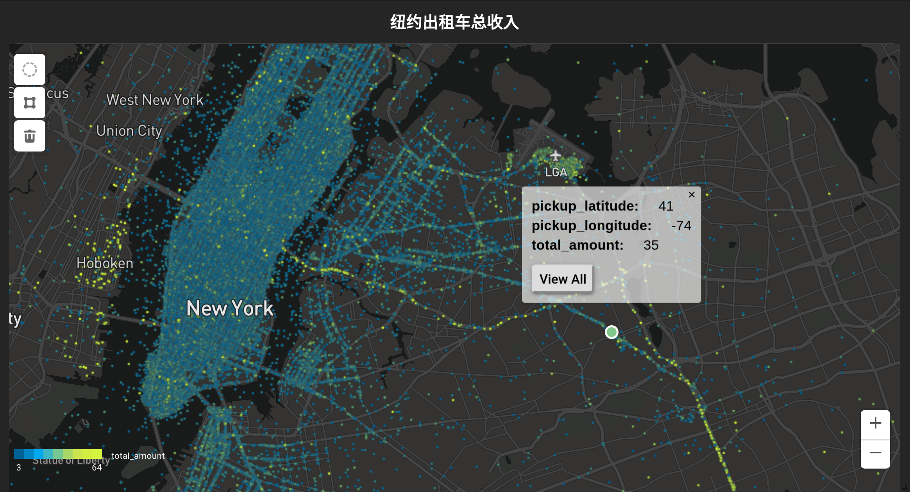

以点图为例，介绍鼠标悬停时的数据查询流程。上图渲染了数据中乘客上车地点的分布数据，当鼠标悬停在某一点的上方时，可显示上车地点的经纬度数据已经该次乘车产生的费用。该过程中，Web前端首先根据鼠标的位置计算当前点的屏幕坐标，并将其转化为地理坐标系中的坐标。之后，再向web server发送查询请求，查询该坐标所对应的原始数据信息。web server调用Arctern在数据集中查询该地理坐标对应的详细信息并返回给前端。前端最后根据结果数据渲染出相关的信息图形，并将其叠加在原始点图上进行展示。

# 4. API介绍

## 4.1 Render Lib

### 4.1.1 Vega 接口

Arctern对于服务器端渲染提供Vega接口，其中的参数用于描述渲染的配置信息。各效果图中有部分参数具有相同含义，比如bounding_box表示前端可视化区域内地图切片的范围，opacity表示渲染图片的透明度，coordinate_system表示输入数据的坐标系统

**点图：**
```python
VegaPointMap (width: int, height: int, bounding_box: list, mark_size: int, mark_color: str, opacity: float, coordinate_system: str)
```

参数含义：
```
mark_size:点的大小
mark_color:点的颜色
```
代码示例：
```python
vega_point = vega_pointmap(1024, 896, [-73.998427, 40.730309, -73.954348, 40.780816], 3, "#2DEF4A", 0.5, "EPSG:4326")
```


**带权点图：**
```python
VegaWeightedPointMap (width: int, height: int, bounding_box: list, mark_color: str, color_ruler: list, stroke_ruler: list, opacity: float, coordinate_system: str)
```

参数含义：
```
mark_color:点的颜色渐变
color_ruler:参与渐变的权值范围
stroke_ruler:点的大小范围
```
代码示例：
```python
vega_weight = vega_weighted_pointmap(1024, 896, [-73.998427, 40.730309, -73.954348, 40.780816], "#87CEEB", [0, 2], [5], 1.0, "EPSG:4326")
```

**热力图**
```python
VegaHeatMap (self, width: int, height: int, map_scale: float, bounding_box: list, coordinate_system: str)
```

参数含义：
```
map_scale:前端地图的缩放比例
```

代码示例：
```python
vega_heat = vega_heatmap(1024, 896, 10.0, [-73.998427, 40.730309, -73.954348, 40.780816], 'EPSG:4326')
```
**轮廓图**
```python
VegaChoroplethMap (self, width: int, height: int, bounding_box: list, color_style: str, ruler: list, opacity: float, coordinate_system: str)
```
参数含义：
```
color_style:颜色的取色范围（内置可选blue_to_red, purple_to_yellow, blue_to_white, white_to_blue）
ruler:热力图颜色规则
```
代码示例：
```python
Vega_ch = vega_choroplethmap(1900, 1410, [-73.994092, 40.753893, -73.977588, 40.759642], "blue_to_red", [2.5, 5], 1.0, 'EPSG:4326')
```

### 4.1.2 Spark 接口

Arctern对接pyspark并提供三种渲染图的接口。

**点图：**
```python
pointmap(df:dataframe, vega:VegaPointMap)
weighted_pointmap(df:dataframe, vega:VegaPointMap)
```

代码示例：
```python
res = pointmap(df, vega_point) 
res = weighted_pointmap(df, vega_weight) 
```
**热力图：**
```python
heatmap(df:dataframe, vega:VegaPointMap)
```

代码示例：
```python
res = heatmap (df, vega_heat) 
```

**轮廓图：**
```python
choroplethmap(df:dataframe, vega:VegaPointMap)
```

代码示例：
```python
res = choroplethmap (df, vega_ch) 
```

### 4.1.3 Pandas 接口

Pandas接口中wkb和c_data是两列输入数据，数据类型分别为binary和numeric(int8,uint8,…),首先创建输入数据：
```python
wkt_data = []
c_data = []
s_data = []

wkt_data.append("POINT (200 200)”)
wkt_data.append("POINT (300 300)”)
wkt_data.append("POINT (400 400)”)
wkt_data.append("POINT (500 500)”)

arr_wkt = pandas.Series(wkt_data)
arr_c = pandas.Series(c_data)
arr_s = pandas.Series(s_data)
arr_wkb = arctern.wkt2wkb(arr_wkt)
```

**点图：**
```python
point_map(wkb:binary, c_data:numeric, conf:VegaPointMap)

weighted_point_map_wkb(wkb:binary, conf:VegaWeightedPointMap, **kwargs)
```

代码示例：
```python
vega_json = vega_point.build()
curve_z1 = arctern.point_map(arr_wkb, vega_json.encode('utf-8'))

vega_json4 = vega_weight.build()
res4 = arctern.weighted_point_map(arr_wkb, vega_json4.encode('utf-8'), cs=arr_c, ss=arr_s)
```


**热力图：**
```python
heat_map(wkb:binary, c_data:numeric, conf:VegaHeatMap)
```
代码示例：
```python
vega_json = vega_heat.build()
heat_map1 = arctern.heat_map(arr_wkb, arr_c, vega_json.encode('utf-8'))
```
**轮廓图：**
```python
choropleth_map(wkb:binary, c_data:numeric, conf:VegaChoroplethMap)
```
代码示例：
```python
vega_json = vega_ch.build()
choropleth_map = arctern.choropleth_map(arr_wkb, arr_c, vega_json.encode('utf-8'))
```


## 4.2 RESTFUL接口

Arctern可视化组件提供RESTFUL API，包含用户管理、数据加载、数据元信息查询、数据查询等接口。这里给出与可视化相关的查询接口。

### 4.2.1 token设置

```shell
-H "Authorization: Token <jws-token>"
```

如果服务器出现逻辑错误，将返回如下结果:

Response:
```json
{
    "status": "error",
    "code": -1,
    "message": "description"
}
```
### 4.2.2 /db/query 数据查询与渲染

Method: POST

Token: YES

```json
request:
    {
      	// database id (an uuid assigned by arctern)
        "id": "176994744547212716762703174102210414029",              
        "query":
        {
            // can be one of the following query types: sql, point, heat, choropleth
            "type": "heat",
          
          	// The sql outputs are used as render inputs. 
          	// For instance, the output of this sql is ['point', 'weight']. 
          	// These two columns are the inputs of heatmap render. 
            "sql": "select ST_Point(pickup_longitude, pickup_latitude) as point, passenger_count as weight from global_temp.nyc_taxi where ST_Within(ST_Point(pickup_longitude, pickup_latitude),  'POLYGON ((-73.998427 40.730309, -73.954348 40.730309, -73.954348 40.780816 ,-73.998427 40.780816, -73.998427 40.730309))')",
          
            "params":
            {
                "width": 1600,     // output image width
                "height": 900,     // output image height

                // parameters of pointmap
                "point" :
                {
                  	// window boundary [x_min,y_min,x_max,y_max]
                    "bounding_box": [-73.998427, 40.730309, -73.954348, 40.780816],
                    "coordinate": "EPSG:4326",	// coordination type
                    "stroke_width": 3,      		// point size
                    "stroke": "#2DEF4A",    		// point color
                    "opacity": 0.5          		// point transparency
                },

                // parameters of heatmap
                "heat":
                {
                  	// window boundary [x_min,y_min,x_max,y_max]
                    "bounding_box": [-73.998427, 40.730309, -73.954348, 40.780816], 
                    "coordinate": "EPSG:4326",  // coordination type
                    "map_scale": 10         		// map scale level
                },

                // parameters of choroplethmap
                "choropleth":
                {
                  	// window boundary [x_min,y_min,x_max,y_max]
                    "bounding_box": [-73.984092, 40.753893, -73.977588, 40.756342],
                    "coordinate": "EPSG:4326",   	// coordination type
                    "color_style": "blue_to_red", // color scheme
                    "rule": [2.5, 5],             // range of color gradients
                    "opacity" : 1                 // choropleth transparency
                }
            }
        }
    }
response:
    {
        "status": "success",
        "code": 200,
        "data":
        {
            "sql": "same sql in request",
            "err": false,
          	// sql outputs, can be data rows or image
            "result": [
                "b64_img_binary"
            ]
        },
        "message": null
    }
```
