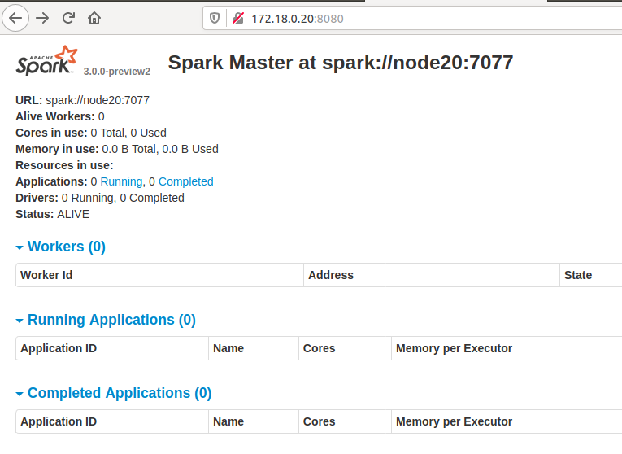
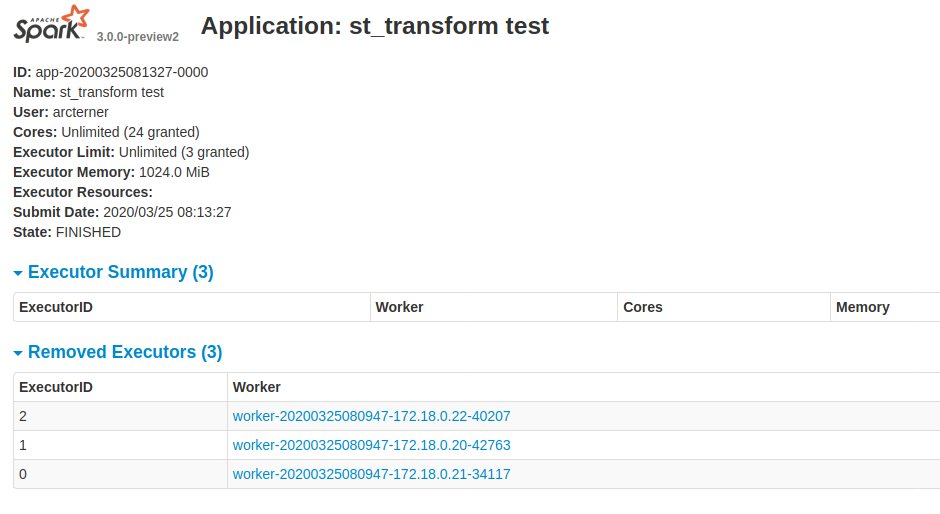

# 使用`docker`模拟`spark-standalone`集群
本文介绍使用`docker`技术在一台主机上启动3个container，这个3个container信息如下，相互间组织成一个`spark-standalone`集群，并在spark集群上运行cpu版的arctern
| host name |ip address | conainer name | type |
| --- | --- | --- | --- |
| node20 | 172.18.0.20 | node20 | master
| node21 | 172.18.0.21 | node21 | worker
| node22 | 172.18.0.22 | node22 | worker

---
## 创建docker子网
创建一个名为`arcternet`的docker子网
```bash
docker network create --subnet=172.18.0.0/16 arcternet
```
----

## 创建集群间的共享目录
创建一个名为`arcternas`的目录作为集群间的共享目录
```bash
mkdir $HOME/arcternas
```

---


## 启动`container`
启动容器，并设置目录`$HOME/arcternas`映射到容器内的`/arcternas`
```bash
docker run -d -ti --name node20 --hostname node20 --net arcternet --ip 172.18.0.20 --add-host node21:172.18.0.21 --add-host node22:172.18.0.22 -v $HOME/arcternas:/arcternas ubuntu:16.04 bash
docker run -d -ti --name node21 --hostname node21 --net arcternet --ip 172.18.0.21 --add-host node20:172.18.0.20 --add-host node22:172.18.0.22 -v $HOME/arcternas:/arcternas ubuntu:16.04 bash
docker run -d -ti --name node22 --hostname node22 --net arcternet --ip 172.18.0.22 --add-host node20:172.18.0.20 --add-host node21:172.18.0.21 -v $HOME/arcternas:/arcternas ubuntu:16.04 bash
```

----

## 安装依赖库
进入`docker`并安装依赖库,以`node20`为例，`node21`和`node22`同此操作
```bash
# 进入 node20
docker exec -it node20 bash
```
以下指令在`node20`上执行
```bash
apt update
apt install -y libgl-dev libosmesa6-dev libglu1-mesa-dev wget openjdk-8-jre openssh-server vim
service ssh start
#新建arcterner用户
useradd -m arcterner -s /bin/bash
#修改arcterner用户密码为arcterner
echo -e "arcterner\narcterner" | passwd arcterner
#修改目录/arcternas为arcterner所有
chown -R arcterner:arcterner /arcternas
exit
```

----

## 设置免密登录
退出`node20`的`root`账户，在`host`上执行以下命令，以`arcterner`用户登录`node20`
```bash
docker exec -it -u arcterner node20 bash
```
只需设置`master`到`woker`的免密登录

```bash
#生成ssh-key，用于免密登录
ssh-keygen -t rsa -P '' -f ~/.ssh/id_rsa

#cat ~/.ssh/id_rsa.pub >> ~/.ssh/authorized_keys

#需要输入密码，密码为arcterner
ssh-copy-id node20
ssh-copy-id node21
ssh-copy-id node22
```

----

## 安装`conda`
```bash
wget https://repo.anaconda.com/miniconda/Miniconda3-latest-Linux-x86_64.sh -O ~/miniconda.sh
bash ~/miniconda.sh -b
echo "source $HOME/miniconda3/etc/profile.d/conda.sh" >> .bashrc
rm ~/miniconda.sh
```
退出并重新进入`node20`，检查`conda`是否安装生效
```bash
hadoop@node20:/$ conda env list
# conda environments:
#
base                  *  /home/hadoop/miniconda3
```

----

## 安装`arctern`
创建一个名为`arctern`的`conda`环境，并安装`arctern-spark`
```bash
conda create -y -n arctern -c conda-forge -c arctern-dev arctern-spark
```
检查`arctern`是否成功安装
```bash
conda activate arctern

(arctern) hadoop@node20:~$ python
Python 3.7.6 | packaged by conda-forge | (default, Mar  5 2020, 15:27:18) 
[GCC 7.3.0] on linux
Type "help", "copyright", "credits" or "license" for more information.
>>> import arctern_pyspark
>>> exit()
```

按以上步骤在`node20`、`node21`、`node22`安装`conda`和`arctern`

----

## 安装`spark`
在`node20`,`node21`,`node22`上分别下载`spark`并解压
```bash
#进入home目录
cd ~/
#下载 spark
wget https://downloads.apache.org/spark/spark-3.0.0-preview2/spark-3.0.0-preview2-bin-hadoop2.7.tgz

#解压 spark
tar -xvf spark-3.0.0-preview2-bin-hadoop2.7.tgz
rm -rf spark-3.0.0-preview2-bin-hadoop2.7.tgz
```
在`node20`,`node21`,`node22`的`~/.bashrc`添加如下内容:
```bash
export SPARK_HOME=$HOME/spark-3.0.0-preview2-bin-hadoop2.7
```

在`node20`,`node21`,`node22`上编辑`～/spark-3.0.0-preview2-bin-hadoop2.7/conf/spark-env.sh`，内容如下
```bash
#!/usr/bin/env bash
export PYSPARK_PYTHON=$HOME/miniconda3/envs/arctern/bin/python
SPARK_WORKER_CORES=2
SPARK_WORKER_MEMORY=4g
```

在`node20`节点上编辑`~/spark-3.0.0-preview2-bin-hadoop2.7/conf/spark-defaults.conf`，内容如下
```txt
spark.executorEnv.PROJ_LIB         /home/arcterner/miniconda3/envs/arctern/share/proj
spark.executorEnv.GDAL_DATA        /home/arcterner/miniconda3/envs/arctern/share/gdal
spark.executor.memory              2g
spark.executor.cores               1
```
结合`spark-env.sh`和`spark.defaults.conf`可知，当前`spark`集群一共有`2×3=6`个`cpu`，`4g×3=12g`内存，并且每个`executor`使用`1`个`cpu`，`2g`内存，一共有`6`个`executor`

在`node20`节点上编辑`~/spark-3.0.0-preview2-bin-hadoop2.7/conf/slaves`,内容如下
```txt
node20
node21
node22
```

---

## 启动`spark`集群
以下操作在`node20`上执行

启动`master`
```bash
$SPARK_HOME/sbin/start-master.sh
```
关闭浏览器代理，在浏览器中输入`http://172.18.0.20:8080/`，验证`master`是否正确启动



启动`slaves`
```bash
$SPARK_HOME/sbin/start-slaves.sh
```


---

## 测试`arctern`
以下操作只在`node20`上执行, 新建`gen.py`文件用于生成测试数据，内容如下
```python
from random import random
cnt=1000000
print("idx,pos")
for i in range(0, cnt):
    lng = random()*360 - 180
    lat = random()*180 - 90
    print(i,"point({} {})".format(lng,lat),sep=',')
```
生成测试数据，并将测试数据存入`/arcternas`
```bash
python gen.py > /arcternas/pos.csv
```
新建`st_transform_test.py`，内容如下
```python
from pyspark.sql import SparkSession
from arctern_pyspark import register_funcs

if __name__ == "__main__":
    spark = SparkSession \
        .builder \
        .appName("st_transform test") \
        .getOrCreate()

    spark.conf.set("spark.sql.execution.arrow.pyspark.enabled", "true")
    register_funcs(spark)

    df=spark.read.format("csv").option("header",True).option("delimiter",",").schema("idx long, pos string").load("/arcternas/pos.csv")
    df.printSchema()
    df.createOrReplaceTempView("pos")
    rst = spark.sql("select idx,pos,st_transform(pos, 'epsg:4326', 'epsg:3857') from pos")
    rst.write.mode("append").csv("/arcternas/st_transform/")
    spark.stop()
```
向`spark`提交`st_transform_test.py`
```bash
$SPARK_HOME/bin/spark-submit --master spark://node20:7077 st_transform_test.py
```
检查`st_transform_test.py`的运行结果
```bash
ls -lh /arcternas/st_transform/
```
也可以在浏览器中检查`st_transform_test.py`的运行情况




----

## 参考文献
- https://spark.apache.org/docs/latest/spark-standalone.html
- https://www.programcreek.com/2018/11/install-spark-on-ubuntu-standalone-mode/